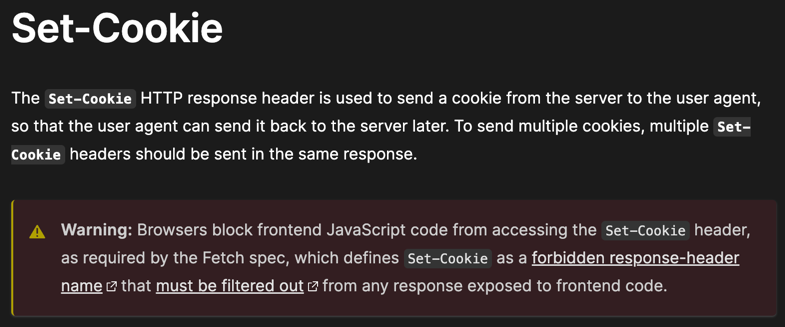

# Grass Extension Review

# Table of contents

- [Background](#background)
- [Does Grass use CursedChrome](#does-grass-use-cursedchrome)
- [Permissions](#permissions)
- [Who is behind Grass](#who-is-behind-grass)
- [Community Node](#community-node)
- [Desktop Node](#desktop-node)
- [The Retraction Video](#the-retraction-video)
- [The Damage Potential](#the-damage-potential)

## Background

I'm a developer for **years**, working in crypto and I want to help protect people from possible issues hence I flag
them
when I see them.

In this article I'll review `Grass` issues I believe should be brought to users attention and also compare them to
alternatives to prove it can be done differently in a better, more secure and privacy-oriented manner.

**If something is unclear, you want to ask, comment, correct, etc. , open an issue, and I'll address it.**

## Does Grass use CursedChrome

The simple answer is YES, we'll prove it in detail.
First [CursedChrome](https://github.com/mandatoryprogrammer/CursedChrome/tree/master) [author](https://x.com/IAmMandatory)
wrote this:

```
This is a tool written for professional red teams.
It helps simulate an often unpracticed attack
scenario involving malicious browser extensions.
If you're planning on using this to maliciously
spy on your friend/girlfriend/victims,
let me know your address and intent and I'll
gladly forward your message to your local LEO for your convenience.
```

Please watch [this video](https://www.youtube.com/watch?v=cdSXdwa5trc) (it's posted on `CursedChrome`
official `GitHub`),
especially `5:30-6:15`.
Explained explicitly `CursedChrome` is highly illegal.
Also watch `7:50-8:30` to see how you can use `CursedChrome` to browse as a different user.

It's clearly stated this is a malware used for security teams research and shouldn't be used in any other way.

First, you can find Grass code in multiple ways:

1. [Grass code](https://github.com/SunsetMkt/getgrass.io-extension) , exists for 5 months on `GitHub`.
2. If you install the extension you can find it on your local drive, see
   details [Where are installed Google Chrome extensions stored locally?](https://stackoverflow.com/questions/21475866/where-are-installed-google-chrome-extensions-stored-locally)
3. If you install the extension you can go to extension settings and click `service worker` and then go
   to `background.js` and see the code.
4. I added a copy here of the extension and community node, before and after they removed the comment regarding
   `CursedChrome`.


Now that you can verify for yourself what Grass code looks like, let's look
at [CursedChrome](https://github.com/mandatoryprogrammer/CursedChrome) and compare.

It's clear that the code was copied, including the comment referencing CursedChrome, later slight modifications were
performed.

## Permissions

What `Grass` actually ask for? See the `manifest.json` file:

```json
{
  "permissions": [
    "storage",
    "background",
    "webRequest",
    "declarativeNetRequestWithHostAccess"
  ]
}
```

Let's go over them one by one:

1. [storage](https://developer.chrome.com/docs/extensions/develop/concepts/storage-and-cookies) this is fine, basically
   used commonly for the extension to remember who you are.
2. [background](https://developer.chrome.com/docs/extensions/reference/permissions-list) this is also fine, lets the
   extension run in the background.
3. [webRequest](https://developer.chrome.com/docs/extensions/reference/permissions-list) this one is
   a **BIG red flag**.
   As stated [webRequest details](https://developer.chrome.com/docs/extensions/reference/api/webRequest)

```
Use the chrome.webRequest API to observe and
analyze traffic and to intercept,
block, or modify requests in-flight.
```

It can intercept and analyze traffic, which means, it can see all your password and authentication cookies and store
them, which `CursedChrome` does.
**There is NO reason for `Grass` to use it, they can scrape without it.**

4. [declarativeNetRequestWithHostAccess](https://developer.chrome.com/docs/extensions/reference/api/declarativeNetRequest)
   another **big red flag**.
   As stated by Google.

```
The chrome.declarativeNetRequest API is used to block or modify
network requests by specifying declarative rules.
This lets extensions modify network requests without intercepting
them and viewing their content, thus providing more
privacy.
```

Again this is NOT needed to scrape, this is mandatory for CursedChrome to operate since they need take your
authentication cookies.

5. We can also see in `manifest.json` they're requesting

```json
{
  "host_permissions": [
    "<all_url/>"
  ]
}
```

Once again, **BIG RED flag**, they can use "https://*" instead which covers all the need for
scraping public data.

## Who is behind Grass

* According
  to [offshorealert](https://www.offshorealert.com/new-order-foundation-v-andrej-radonjic-et-al-writ-of-summons/) seems
  that [Andrej](https://x.com/0xdrej) has some unfinished legal matters, given all the CursedChrome issues, he should
  explain this too. Maybe it's [New Order](https://x.com/neworderdao) , not clear, but should be explained.


* In [The data must flow](https://www.decentralised.co/p/the-data-must-flow) article we found a freudian slip by Andrej.
  He admits to operating a **proxy provider in an unethical manner**, notice he's a **PROVIDER** , not a user.
  [More details on this industry](https://medium.com/spur-intelligence/residential-proxies-the-legal-botnet-that-nobody-talks-about-4470cae7e3c).
  This with `CursedChrome` raises serious questions, do we want this person to have our authenticated sessions? Probably
  not.


* Let's compare `Grass` number of reviews vs. other popular extensions.

| Name                                                                                                           | Number of downloads | Number of reviews | %     | Reviews quality |
|----------------------------------------------------------------------------------------------------------------|---------------------|-------------------|-------|-----------------|
| [AdBlock](https://chromewebstore.google.com/detail/adblock-plus-free-ad-bloc/cfhdojbkjhnklbpkdaibdccddilifddb) | 40,000,000          | 183,200           | 0.458 | High            |
| [EverNote](https://chromewebstore.google.com/detail/evernote-web-clipper/pioclpoplcdbaefihamjohnefbikjilc)     | 2,000,000           | 129,800           | 6.49  | High            |
| [Grass](https://chromewebstore.google.com/detail/grass-lite-node/ilehaonighjijnmpnagapkhpcdbhclfg)             | 1,000,000           | 3,200             | 0.3   | Very low        |

`Grass` has the lowest % of reviews, even though all their reviews are basically people spamming their referral code.
Which makes it even more strange, since it's a very low effort review vs. people actually giving inputs.
This raises a concern regarding if `Grass` are using automated bots to download their extension and inflate their
numbers. I cannot say this for sure, but it looks odd.


## Community Node

The community node is the same code (also uploaded here), but you're asked to install it manually,
probably to **avoid Google store policies** and possibly being **kicked out** after they find out about all
of this `CursedChrome` issues. They're giving higher incentives for it for a reason, is this it?

## Desktop Node

Grass proudly shows [AppEsteem](https://customer.appesteem.com/certified?vendor=GRASS) to prove they're legit.
Some points you should be aware of, `AppEsteem` will most likely give their certificate for anyone that pays for it.
Quick search came up
with [Is AppEsteem certification reliable](https://www.reddit.com/r/Windows10/comments/grlyuc/is_appesteem_certification_reliable/) ,
as you can see by the comments, they allegedly sale their certificate to anyone that pays.
Keep in mind that the `certification` wasn't performed for the `Chrome` extension but for the desktop clients.
Hence, it has no value in regard to the extension.

Being in crypto you should NOT install closed source software by other crypto related companies.
I'll outline how easy it is to steal your private key.

1. All your keys
   are [stored in a database locally](https://stackoverflow.com/questions/15801798/where-is-google-chrome-local-storage-saved)
   , usually they are encrypted by your password. But any closed source desktop application can access the local DB and
   upload it to their servers.
2. Most people use weak password, so brute forcing the database is
   easy [example 1](https://nordpass.com/most-common-passwords-list/), [example 2](https://www.prnewswire.com/news-releases/survey-reveals-nearly-90-of-it-pros-felt-prepared-for-a-password-based-cyberattack-yet-more-than-half-fell-victim-to-one-302012760.html).
3. Desktop application can use a keylogger to find your password when you type it, send it to the server to decrypt your
   keys.

I must say, **use OPEN source products**, where you or others can verify no malicious action is
performed.

## The Retraction Video

Some of you may have seen [Was I WRONG about GRASS?](https://www.youtube.com/watch?v=afg6akCp_UU) and thought, oh it's
ok.
Let's break it down.

1. [virustotal](https://www.virustotal.com/gui/home/upload) was used to examine the various products of Grass.
   The person in the video forgot to create a control group to see the value of this tool.
   You want proof? Take the
   original [CursedChrome background.js](https://raw.githubusercontent.com/mandatoryprogrammer/CursedChrome/master/extension/src/bg/background.js)
   and insert it into the tool, here are
   the [results I got](https://www.virustotal.com/gui/url/c6731d37a238c24d7111a265763b67e162b9a32b1ff9ed8c5ca4ef31daa2fac2).
   **A perfect score, for a tool EXPLICITLY written as a malware**.
2. Claims of `we just accidenly had some comments inside` , this is pure BS, if you believe this, I got a great deal to
   sell you a bridge.
   If you ever wrote one line of code, you know long comments like this don't just accidentally get written.
   See how long and detailed this comment, it couldn't get there by mistake, the only way was someone
   copied `CursedChrome` code over.

```
  // Replace the below connection URI with whatever
  // the host details you're using are.
  // ** Ideal setup is the following **
  // Have Nginx doing a reverse-proxy (proxy_pass) to
  // the CursedChrome server with a HTTPS cert setup.
  // For SSL/TLS WebSockets, instead of https:// you need
  // to use wss:// as the protocol. For maximum stealth,
  // setting the WebSocket port to be the standard
  // TLS/SSL port (this will make sure tools like little
  // snitch don't alert on a new port connection from Chrome).
```

To further prove it was 100% copy of `CursedChrome` let's examine some portion of the source code.

**CursedChrome**

```javascript
        // Format headers
var redirect_hack_headers = {};
response_metadata.headers.map(header_data => {
    // Original Set-Cookie may merge multiple headers, skip it
    if (header_data.name.toLowerCase() !== 'set-cookie') {
        if (header_data.name === 'X-Set-Cookie') {
            redirect_hack_headers['Set-Cookie'] = JSON.parse(header_data.value);
        } else {
            redirect_hack_headers[header_data.name] = header_data.value;
        }
    }
});
```

**Grass**

```javascript
function extractCookies(responseHeaders) {
    const cookies = [];
    responseHeaders.forEach((header) => {
        if (header.name.toLowerCase() === "set-cookie") {
            if (Object.hasOwn(header, 'value')) {
                cookies.push(header.value);
            } else if (Object.hasOwn(header, 'binaryValue')) {
                cookies.push(header.binaryValue);
            }
        }
    });
    return cookies;
}
```

These two have the same functionality other than minor refactor, to extract authenticated sessions.
Let's see what [set-cookie](https://developer.mozilla.org/en-US/docs/Web/HTTP/Headers/Set-Cookie) does.



According to official spec, [set-cookie](https://developer.mozilla.org/en-US/docs/Web/HTTP/Headers/Set-Cookie) is
an extremely important header, that browsers **BLOCK** access to, due to the security risk.
Due to the unneeded and elevated permissions `Grass` requests, it's able to access it and take control
over your authentication sessions, effectively giving it access to any site you log into.

## The Damage Potential

Given all that we covered here, it's safe to assume:

1. Grass holds MANY authenticated session cookies, that can access your personal
   data, [see this video as proof](https://www.youtube.com/watch?v=cdSXdwa5trc).
2. Even if they supposedly don't intend to do anything malicious with it, they are now a **HUGE target for hackers**,
   the
   value stored in these authenticated sessions can be millions of dollars. Bank accounts, personal information ,
   medical information and more.
3. Seeing how Grass didn't even bother to clean up CursedChrome comment, even if I give them the doubt of being
   non-malicious (which I don't), **they are obviously not highly competent and quite lazy (not even removing comments
   they copy over)**. I would be very scared that they hold authenticated sessions of mine if I were you.
